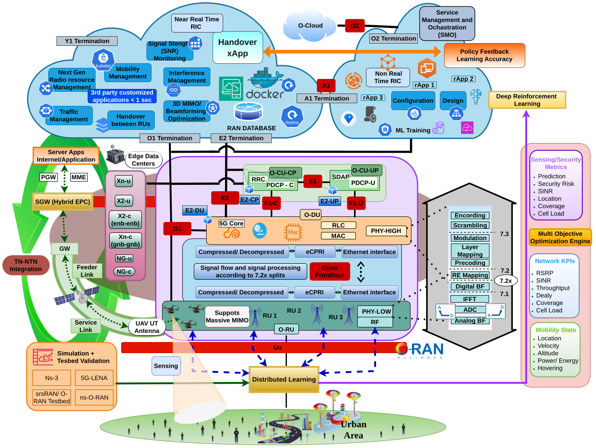
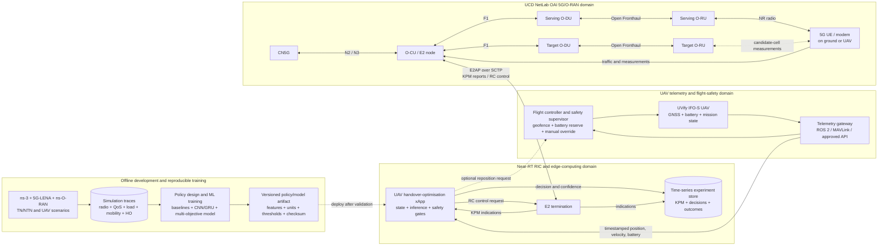

# Learning-Enabled O-RAN Automation for UAV Networks

> An ns-3, 5G-LENA, and ns-O-RAN research framework for terrestrial/non-terrestrial network (TN/NTN) handover, UAV-assisted coverage, and learning-enabled Near-RT RIC control.

- **Research area:** multi-objective handover optimisation for automated UAV networks
- **Network stack:** ns-3, 5G-LENA NR, and ns-O-RAN
- **Control:** Near-Real-Time RAN Intelligent Controller (Near-RT RIC) logic modules
- **License:** GNU General Public License v2.0 (GPL-2.0-only)
- **Author and maintainer:** Kasunika Awanthi Kumari Jayasundara Mudiyanselage (Awanthi Jayasundara), University College Dublin

## Overview

This repository extends ns-3's NR and ns-O-RAN capabilities to study mobility and service continuity in UAV-assisted 5G/6G networks. It provides an end-to-end discrete-event simulation environment in which terrestrial gNBs, non-terrestrial nodes, UAV-mounted gNBs, and mobile user equipment interact with an O-RAN control loop.

The Near-RT RIC collects live radio, mobility, traffic, and cell-load measurements. Configurable logic modules use those measurements to select handover targets, coordinate commands, and support reactive or predictive UAV repositioning. The generated traces expose protocol behaviour, telemetry, and performance metrics needed for reproducible comparison with conventional handover strategies.

The framework supports research on:

- NR-to-NR handover using RSRP, hysteresis, timing, and cell-capacity constraints;
- terrestrial and non-terrestrial network integration with satellite backhaul;
- UAV and ground-user mobility;
- O-RAN E2 reporting, SQLite data storage, and conflict mitigation;
- secrecy-aware and sensing-assisted handover decisions;
- ML-based prediction of underserved-user hotspots; and
- multi-objective optimisation using radio quality, mobility stability, load, energy, QoS, and security information.

## Architecture



The implemented closed loop is:

1. NR UEs and gNBs register as E2 nodes.
2. UEs report location, serving-cell information, RSRP/RSRQ, and application statistics.
3. gNBs report location and cell-load indicators derived from MAC scheduling callbacks.
4. The Near-RT RIC stores reports in an SQLite repository and periodically invokes a logic module.
5. The logic module selects a target and emits an NR-to-NR handover command.
6. A Conflict Mitigation Module (CMM) schedules the command for execution at the source gNB.

### Relationship to an srsRAN Near-RT RIC testbed

This repository models the O-RAN control loop entirely inside ns-3. Its E2 terminators, reports, logic modules, commands, and SQLite repository are simulation abstractions; they do **not** currently provide a network-facing E2AP/SCTP endpoint or directly connect to an external Near-RT RIC.

The [srsRAN Near-RT RIC and xApp tutorial](https://docs.srsran.com/projects/project/en/latest/tutorials/source/near-rt-ric/source/index.html) is the reference workflow for a later real-time/testbed validation stage. That workflow uses an srsRAN gNB with an E2 agent, Open5GS, a UE, and either ORAN SC RIC or FlexRIC. It enables the E2SM-KPM service model for measurements and E2SM-RC for control.

Moving an algorithm from this simulator to that testbed therefore requires an adapter or xApp implementation with the following mapping:

| Research input/action | ns-3 implementation | Testbed equivalent or requirement |
|---|---|---|
| E2 node identity | ns-3 node/E2 terminator ID | PLMN, gNB/DU identity, and RAN function ID |
| UE identity | IMSI and RNTI in reports | Stable UE key plus the identifiers exposed by KPM/RC messages |
| Radio measurements | NR RSRP/RSRQ reporters | E2SM-KPM measurement records; confirm that the chosen gNB version exposes real rather than placeholder values |
| QoS measurements | FlowMonitor and application reports | KPM metrics such as downlink/uplink UE throughput, packet success/drop rate, and transmitted RLC SDU volume |
| Cell load | NR MAC scheduling callbacks | Scheduler/KPM metrics, normalized to a documented cell-load definition |
| Mobility | Exact simulated UE/UAV coordinates | Timestamped position source external to KPM, such as GNSS or a testbed telemetry feed |
| Handover decision | O-RAN logic module | xApp subscription, state store, and decision function |
| Handover command | `OranCommandNr2NrHandover` | Supported E2SM-RC control action; verify target-cell and UE-control capabilities in the selected srsRAN release |
| Validation evidence | SQLite, CSV traces, and ns-3 logs | RIC/xApp logs, gNB logs, KPM indications, E2AP packet capture, traffic results, and handover events |

At minimum, a cross-platform evaluation dataset should record a monotonic timestamp, run/scenario ID, E2 node and UE identifiers, serving and candidate cell IDs, RSRP/RSRQ/SINR where available, DL/UL throughput, packet loss/drop indicators, cell load, UE/UAV position, decision reason, command timestamp, handover result, and failure cause. Units, reporting interval, missing-value encoding, and clock source must be documented. This allows the same policy to be evaluated fairly in ns-3 and in a live or emulated RAN.

For the tutorial-style testbed, the external prerequisites are Ubuntu, srsRAN Project, srsUE, ZeroMQ, Open5GS, a supported Near-RT RIC, and Wireshark for E2AP inspection. The gNB must be configured with its DU E2 agent and the required KPM/RC service models enabled, along with RLC and scheduler metric reporting. Start the components in dependency order: 5G Core, Near-RT RIC, gNB, UE, user traffic, and finally the xApp. These packages are **not** dependencies of the ns-3 simulations in this repository.

Interoperability work should pin the exact srsRAN, RIC, service-model, and E2AP versions. The referenced tutorial describes E2AP/E2SM/KPM/RC revision 3 and notes implementation limitations; compatibility must be rechecked against the versions used in each experiment.

## Target UCD NetLab implementation

The ultimate research target is to transfer the handover policy developed in ns-3 into a UAV handover-optimisation xApp and validate it on the [UCD NetLab 6G AI-RAN Security Test Network](https://netslab.ucd.ie/testbed/). NetLab is based on **OpenAirInterface (OAI)** rather than srsRAN, so the OAI E2 agent and its supported service-model versions must be used for the final integration. The srsRAN tutorial above remains a useful operational reference for E2 setup, subscriptions, metrics, packet capture, and component startup order.

### Target end-to-end architecture



The solid E2 control path is for RAN handover decisions. A request to physically reposition a UAV is a different control problem and must pass through an approved flight controller and safety supervisor; it should not be treated as an ordinary E2 handover command.

### xApp decision loop

For each UE and decision interval, the target xApp should:

1. subscribe to the KPM measurements available from the OAI E2 nodes;
2. join KPM data with UE/UAV telemetry using synchronized timestamps and stable identifiers;
3. maintain a short history window for mobility and trend prediction;
4. filter candidate cells by availability, minimum radio quality, capacity, security policy, and UAV-energy constraints;
5. score the remaining candidates using the selected baseline or learned multi-objective policy;
6. apply hysteresis, time-to-trigger, confidence, cooldown, and ping-pong protection;
7. issue a supported E2SM-RC handover/control request, or fall back to a documented non-E2 test API if the selected OAI release lacks that action;
8. correlate the request with RRC/E2 outcomes and record success, failure cause, interruption time, and post-handover QoS; and
9. enter a safe fallback mode if measurements are stale, the model fails, identifiers cannot be resolved, or control acknowledgement times out.

The first testbed version should be deterministic and explainable: reproduce the RSRP-plus-hysteresis baseline, then add cell load, and only then deploy the learned multi-objective policy. This staged approach gives each later result a defensible baseline.

### Resources already described by UCD NetLab

The public NetLab page identifies the following resources:

| Resource | Intended role in this research |
|---|---|
| OAI CN5G | Registration, sessions, mobility anchoring, and user-plane connectivity |
| O-CU and five O-DUs | Multi-cell RAN processing and potential E2-node placement |
| Benetel indoor/outdoor O-RUs | At least two radio cells are required for a handover experiment |
| Dell edge servers, including a Precision 7920 | Near-RT RIC, xApp, data collection, inference, and experiment orchestration |
| Two NI Ettus B200 USRPs and one NI Ettus X410 SDR | Controlled radio experiments, emulation, or additional RF endpoints, subject to the selected topology |
| Two Quectel RM500 5G modems and 5G dongles | Mobile UE endpoints for repeatable handover and traffic tests |
| Two UVify IFO-S drones | UAV mobility and telemetry experiments, subject to flight and payload approval |
| Nvidia Jetson AGX Orin and Raspberry Pi 4 devices | Onboard/edge telemetry gateway or optional distributed inference |
| 3.8–4.2 GHz ComReg test licence | Licensed over-the-air experimentation under the testbed's approved conditions |

These resources are reported by the testbed website; their availability, exact models, firmware, supported bands, and booking conditions must be confirmed before an experiment.

### Resources and access that still need confirmation

Before claiming an end-to-end xApp-controlled handover demonstration, confirm or provision:

- two simultaneously operational and overlapping NR cells with safe, calibrated RF coverage;
- an OAI release with a working E2 agent and compatible E2AP, E2SM-KPM, and E2SM-RC versions;
- the exact RC control style/action required to identify a UE and target cell;
- a Near-RT RIC distribution compatible with that OAI build, plus xApp SDK and deployment access;
- KPM metric availability and granularity for RSRP/RSRQ/SINR, throughput, packet loss, PRB or cell utilisation, and per-UE measurements;
- access to RRC handover events and failure causes for ground-truth labelling;
- synchronized clocks across RIC, CU/DU, UE traffic generator, telemetry gateway, and data collector (NTP for initial work; PTP where tighter timing is required);
- routable management, E2/SCTP, F1, fronthaul, core, telemetry, and user-plane networks with documented IP addresses and firewall rules;
- UE provisioning, SIM credentials, traffic-generation hosts, and repeatable UE mobility or channel-control procedures;
- UAV payload, power, communications, GNSS, telemetry API, geofence, manual override, battery-reserve policy, and institutional flight approval;
- secure model and xApp deployment, authentication/authorization, secrets management, audit logs, and an emergency stop/rollback procedure; and
- experiment booking, spectrum/licence conditions, privacy review, risk assessment, and data-management approval.

### Minimum experiment record

Every run should preserve enough information to reproduce both the radio conditions and the xApp decision:

- experiment ID, scenario, software commit/container digest, model checksum, configuration, random seed, and start time;
- synchronized monotonic and wall-clock timestamps;
- E2 node, cell, UE, RNTI, and anonymized subscriber identifiers with an explicit identity-mapping lifetime;
- serving/candidate measurements with metric name, value, unit, source layer, aggregation window, and missing-data flag;
- throughput, latency, jitter, packet loss, cell/PRB load, UE/UAV position and velocity, UAV battery, and mission state;
- complete candidate set, normalized feature vector, constraints, model output, confidence, chosen action, and human-readable decision reason;
- E2 subscription/control transaction identifiers and request, acknowledgement, execution, and timeout timestamps;
- RRC handover start/end, source and target cells, success/failure cause, interruption time, ping-pong label, and post-handover QoS; and
- safety interventions, stale-data events, xApp/RIC restarts, packet captures, and relevant CU/DU/core/UE logs.

Personally identifying subscriber data should not be stored unless it is necessary and approved. Use pseudonymous experiment identifiers and document retention and access controls.

### Validation sequence

1. **Software-in-the-loop:** validate all policies in ns-3 using fixed seeds and identical scenarios.
2. **RIC integration without radio control:** connect an xApp to emulated or replayed KPM data and verify subscriptions, timing, state, and logs.
3. **Passive testbed observation:** receive live KPM data from OAI without issuing control actions.
4. **Closed-loop static UE test:** enable handover control between two cells under attenuated or otherwise controlled RF conditions.
5. **Ground mobility test:** repeat with a modem moved through a documented path before introducing a drone.
6. **Tethered/contained UAV test:** validate telemetry, timing, payload, radio behaviour, and safety fallback.
7. **Approved free-flight experiment:** evaluate the xApp with geofencing, manual override, staged traffic load, and predefined abort criteria.
8. **Comparative evaluation:** compare conventional handover, RSRP/hysteresis xApp, load-aware xApp, and the final multi-objective learned xApp using the same scenarios and statistical reporting.

## Main extensions

### NR support for ns-O-RAN

- NR UE cell-information and RSRP/RSRQ reporters;
- NR and LTE cell-load reports;
- NR gNB and UE E2 node terminators;
- NR-to-NR handover commands and trigger reports;
- NR Fractional Frequency Reuse (FFR) algorithm and service access points;
- CMM handover coordination and single-command-per-node control; and
- generic and SQLite-backed O-RAN data repositories.

Most O-RAN extensions are under [`contrib/oran`](contrib/oran). See the [module README](contrib/oran/README.md) for the lower-level model and API documentation.

### Load-aware handover

`OranLmNr2NrRsrpHandoverWithCellLoad` selects targets using:

- an RSRP improvement and configurable hysteresis margin;
- warm-up, command cooldown, and pending-handover timeout gates;
- a minimum acceptable target RSRP;
- an optional maximum number of UEs per cell; and
- next-best-cell fallback when the strongest candidate is full.

Setting `MaxUesPerCell` to `0` disables the capacity constraint. Pending handovers reserve target capacity so that several decisions in one RIC interval cannot overfill a cell.

### Predictive UAV repositioning

[`train_uav_trajectory_final.py`](train_uav_trajectory_final.py) converts UE trajectories and O-RAN events into time-ordered underserved-user heatmaps. It compares persistence, multilayer perceptron (MLP), convolutional neural network (CNN), and gated recurrent unit (GRU) predictors using chronological training, validation, and test partitions. Selected CNN or GRU models can be exported to ONNX and evaluated inside the simulation.

## Requirements

- A Linux environment suitable for building ns-3
- CMake 3.20
- SQLite 3.7.17 or later
- The dependencies required by the bundled ns-3, NR/5G-LENA, and ns-O-RAN modules
- ONNX Runtime 1.14.1 (optional, for ONNX inference)
- PyTorch 2.2.2 and the Python training dependencies (optional, for ML training)

The checked-out tree identifies itself as the ns-3 development version (`3-dev`). Optional ML dependencies are not required for the policy-based examples.

## Build

From the repository root:

```bash
./ns3 configure --build-profile=optimized --enable-logs --enable-examples --enable-tests
./ns3 build
```

For dependency setup, optional ONNX/PyTorch integration, and module-specific build instructions, see [`contrib/oran/README.md`](contrib/oran/README.md).

## Run

The main NR examples are grouped below. Run any target from the repository root with `./ns3 run`.

### RSRP and load-aware handover

```bash
./ns3 run "oran-nr-tn-rsrp-handover-example"
./ns3 run "oran-nr-ntn-rsrp-handover-example"
./ns3 run "oran-nr-uav-rsrp-handover-example"
./ns3 run "oran-nr-uav-load-aware-rsrp-handover-example"
```

### UAV and ground-user scenarios

```bash
./ns3 run "oran-nr-uav-ground-traffic-handover-example"
./ns3 run "oran-nr-uav-ground-qos-handover-example"
./ns3 run "oran-nr-uav-ground-fronthaul-handover-example"
./ns3 run "oran-nr-tn-ntn-load-aware-handover-example"
./ns3 run "oran-nr-tn-ntn-xr-handover-example"
./ns3 run "oran-nr-tn-ntn-uav-mobility-handover-example"
```

### TN/NTN, security, and satellite-backhaul scenarios

```bash
./ns3 run "oran-nr-tn-ntn-rsrp-handover-example"
./ns3 run "oran-nr-tn-ntn-hybrid-xr-example"
./ns3 run "oran-nr-tn-ntn-baseline-handover-example"
./ns3 run "oran-nr-tn-ntn-secrecy-handover-example"
./ns3 run "oran-nr-tn-ntn-secrecy-onnx-handover-example"
./ns3 run "oran-nr-uav-satellite-backhaul-example"
./ns3 run "oran-nr-tn-ntn-uav-satellite-handover-example"
./ns3 run "oran-nr-tn-ntn-uav-satellite-ml-load-handover-example"
./ns3 run "oran-nr-tn-uav-satellite-handover-example"
./ns3 run "oran-nr-hybrid-tn-ntn-uav-satellite-handover-example"
```

### Detailed O-RAN logging

After building with `--enable-logs`, enable the scenario's O-RAN information log to record load snapshots, time-to-trigger waits, handover commands, and low-RSRP rejections:

```bash
./ns3 run "oran-nr-tn-ntn-uav-satellite-handover-example \
  --sim-time=40 --use-oran=1 --enable-oran-info-log=1 \
  --enable-decision-csv=1 --enable-position-trace=1 \
  --enable-handover-trace=1 --enable-handover-failure-trace=1"
```

Common outputs include position and RSRP traces, handover success/failure events, decision CSV files, FlowMonitor KPIs, `ns3-oran-lm.log`, and an SQLite report/command database. Exact output names depend on the selected example and command-line options.

## ML workflow

Train the heatmap predictors after generating position traces and the ML handover dataset:

```bash
python3 train_uav_trajectory_final.py \
  --ues1 results/nr/tn-ntn/<run>/ues1-position-trace.tr \
  --ues2 results/nr/tn-ntn/<run>/ues2-position-trace.tr \
  --ml-csv results/nr/tn-ntn/<run>/ml-ho-dataset.csv \
  --log results/nr/tn-ntn/<run>/ns3-oran-lm.log \
  --outdir results/nr/tn-ntn/ml_uav_final \
  --train-ratio 0.60 --val-ratio 0.15 --event-time-tolerance 2.5
```

Export a GRU model for ONNX inference:

```bash
python3 train_uav_trajectory_final.py \
  --rsrp-thresh -120 --export-onnx --export-model gru
```

Then pass the generated model to the predictive scenario:

```bash
./ns3 run "oran-nr-tn-ntn-uav-satellite-ml-load-handover-example \
  --sim-time=122 --enable-predictive-uav=1 \
  --uav-predictor-onnx=results/nr/tn-ntn/ml_uav_final/uav_underserved_heatmap_gru_ir8.onnx \
  --uav-heat-norm-max=3 --uav-underserved-rsrp-thresh=-120 \
  --db-file=oran-gru.db --run-tag=gru"
```

`--uav-heat-norm-max` must match `normalization_max_count` in the generated `predictor_config.json`, and the inference RSRP threshold must match the training threshold. Use distinct database files and run tags when comparing models.

## Evaluation metrics

Depending on the scenario, the framework records:

- throughput, end-to-end delay, jitter, packet delivery ratio, and packet loss ratio;
- RSRP/RSRQ, SINR, serving-cell association, and cell load;
- handover attempts, successes, failures, and ping-pong events;
- UE and UAV trajectories;
- satellite-backhaul state; and
- ML training history and predictor-comparison results.

NR simulations can be substantially slower than LTE simulations because the 3GPP channel model, fading, beamforming, bandwidth-part processing, OFDMA scheduling, mobility, and frequent tracing add computational cost. Use an optimized build and disable unneeded traces for large experiments.

## Project status

Implemented work includes NR-compatible O-RAN reporting and control, RSRP/load-aware NR handover, TN/NTN and satellite-backhaul scenarios, secrecy-aware experiments, and CNN/GRU-based underserved-hotspot prediction.

Ongoing research extends the framework toward multi-objective decision-making that jointly considers radio quality, handover stability, cell load, UAV energy, QoS, sensing information, and security risk. The target validation stage will package the decision logic as an xApp and connect it to the OAI-based UCD NetLab through a compatible Near-RT RIC after the required KPM/RC data and control mappings are implemented. Experimental features and results should be treated as research software rather than production network-control code.

## Citing

If this repository supports your research, please cite it as software:

```bibtex
@software{jayasundara2026oran_uav,
  author  = {Jayasundara Mudiyanselage, Kasunika Awanthi Kumari},
  title   = {Learning-Enabled O-RAN Automation for UAV Networks: an ns-3 NR/ORAN Simulation Framework},
  year    = {2026},
  url     = {https://github.com/AwanthiJayasundara/ns-3-dev-nr-oran},
  note    = {Research software, University College Dublin}
}
```

Please also cite the relevant ns-3, 5G-LENA, ns-O-RAN, and other upstream publications when using their models.

## License and third-party software

This repository is distributed under the **GNU General Public License v2.0 only (GPL-2.0-only)**. See [`LICENSE`](LICENSE) for the full terms.

The repository incorporates and extends upstream ns-3, 5G-LENA, and ns-O-RAN software. Third-party components retain their own copyright notices and license terms; consult [`LICENSES`](LICENSES) and component-level license files, including the ONNX Runtime license where applicable. The license does not imply endorsement by upstream projects or institutions.

## Author and acknowledgement

The UAV/O-RAN research extensions are developed and maintained by **K. A. K. Jayasundara Mudiyanselage (Awanthi Jayasundara)**, School of Electrical and Electronic Engineering, University College Dublin, under the supervision of **Dr. Pasika Ranaweera** and co-supervision of **Dr. Nima Afraz**.

This work builds on the contributions of the ns-3, 5G-LENA, and ns-O-RAN communities. See [`AUTHORS`](AUTHORS) and the repository history for upstream and individual contributions.

## Contributing

Contributions and reproducible bug reports are welcome. Before submitting a change, build the affected targets, run relevant tests, and avoid committing generated databases, traces, model checkpoints, or result directories. General contribution guidance is available in [`CONTRIBUTING.md`](CONTRIBUTING.md).
